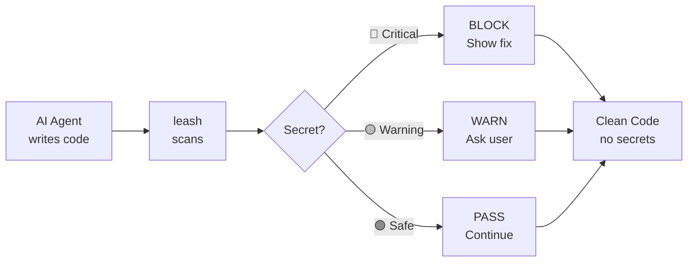

---
hide:
  - navigation
---

<div class="leash-hero" markdown>

{ width="160" }

# leash

**Your AI writes fast. Leash makes sure it doesn't run away with your secrets.**

[Get Started](getting-started/installation.md){ .md-button .md-button--primary }
[View on GitHub](https://github.com/FasterApiWeb/leash){ .md-button }

</div>

<div class="leash-stats" markdown>

<div class="leash-stat" markdown>
<strong>71</strong>
Secret Patterns
</div>

<div class="leash-stat" markdown>
<strong>11</strong>
Provider Categories
</div>

<div class="leash-stat" markdown>
<strong>20+</strong>
AI Agents Supported
</div>

<div class="leash-stat" markdown>
<strong>94%</strong>
Detection Rate
</div>

</div>

---

## The Problem

AI coding agents write code at lightning speed. GPT, Claude, Copilot — they're incredible at generating code. But they have a problem: **they don't know your secrets are secret.**

Every day, AI-generated code pushes API keys, database passwords, and cloud credentials straight into public repositories. GitHub's own secret scanning catches millions of leaked secrets per year. With AI writing more code than ever, the problem is accelerating.

!!! danger "Other tools catch secrets after they're committed. Leash catches them while the AI is still typing."

## Before / After

You ask your AI agent to set up a Stripe integration. Without leash:

```python
import stripe

stripe.api_key = "sk_live_" + "51H7mKjG8z4x9vRnC3yT5qW2bA0xF6pL8dM1nO4kJ7sE9iU"

def create_payment(amount, currency="usd"):
    return stripe.PaymentIntent.create(amount=amount, currency=currency)
```

Your production Stripe key. In your source code. One `git push` from being public.

With leash:

```
⛔ LEASH — SECRET DETECTED
━━━━━━━━━━━━━━━━━━━━━━━━━━━━━━━━━━━━━━
Type:     Stripe Live Secret Key
File:     payments.py:3
Value:    sk_liv....9iU
Risk:     CRITICAL — Can create charges, refunds, and transfer
          real money. Access to all customer payment data.
━━━━━━━━━━━━━━━━━━━━━━━━━━━━━━━━━━━━━━
FIX:
  1. Use environment variable:
     stripe.api_key = os.environ["STRIPE_SECRET_KEY"]
  2. Add to .env.example:
     STRIPE_SECRET_KEY=your-stripe-secret-key-here
  3. Ensure .env is in .gitignore
━━━━━━━━━━━━━━━━━━━━━━━━━━━━━━━━━━━━━━
```

The agent stops. Shows the risk. Provides the fix. Your key never reaches the codebase.

## How It Works



1. **Install** drops a skill/rule file into your AI agent
2. **Skill** instructs the agent to run the Leash Protocol on every code change
3. **71 regex patterns** match specific secret formats (not vague heuristics)
4. **Pre-commit hook** as a backup safety net

No server, no API, no telemetry. Everything runs locally.

## Quick Install

=== "macOS / Linux / WSL"

    ```bash
    curl -fsSL https://raw.githubusercontent.com/FasterApiWeb/leash/main/scripts/install.sh | bash
    ```

=== "Windows"

    ```powershell
    irm https://raw.githubusercontent.com/FasterApiWeb/leash/main/scripts/install.ps1 | iex
    ```

=== "Manual"

    Copy the rule file for your agent. See [Installation](getting-started/installation.md) for all agents.

---

<div style="text-align: center; margin-top: 3rem;" markdown>

**Every star helps another developer find leash before their secrets find the internet.**

[:star: Star on GitHub](https://github.com/FasterApiWeb/leash){ .md-button }

</div>
